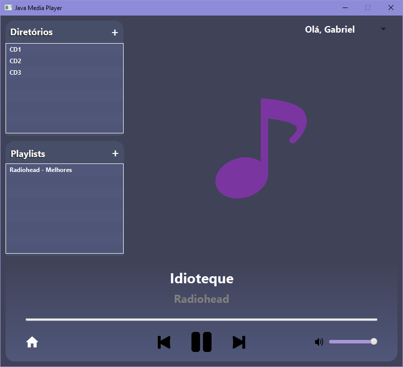

## JavaMediaPlayer
JavaMediaPlayer é uma aplicação que reproduz mídias MP3 desenvolvida no Framework JavaFX.

## Pré-requisitos
- Java Development Kit (JDK) - 19
- Apache Maven 3.8.6

As instruções de instalação do Maven podem ser consultadas através desse [link](https://maven.apache.org/install.html).

## Compilação e Execução
Por contar com a utilização de módulos (JavaFX e jaudiotagger), o projeto foi desenvolvido com a ajuda do Maven, uma ferramenta que automatiza a compilação e lida com as dependências automaticamente. Para compilá-lo e executá-lo, basta executar no diretório do projeto o comando

    mvn clean javafx:run

Alternativamente, o projeto pode ser executado através de uma IDE com suporte para a ferramenta, como o Eclipse ou IntelliJ. Basta importar um projeto Maven e selecionar o diretório do projeto.

